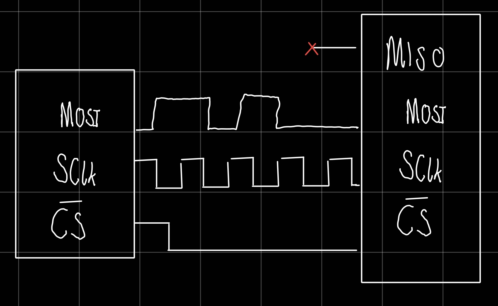
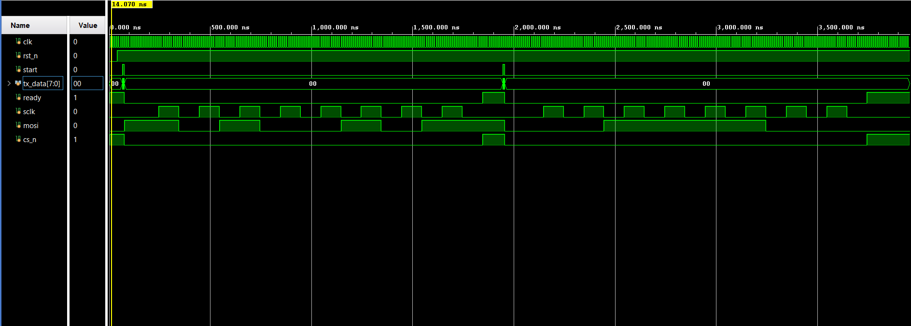

## Hardware Design Process & Architecture Decisions

When designing this SPI master, several strict design decisions were made to optimize the logic footprint and ensure perfect synchronization with the target peripheral (SH1106 OLED display).

### 1. The 3-Wire Interface Optimization (Omitting MISO)
Standard SPI typically utilizes a 4-wire bus (SCLK, MOSI, MISO, CS). However, standard OLED modules are inherently **write-only data sinks**. The FPGA pushes initialization commands and pixel data to the screen, but the display never transmits any data back to the host. 
* **The Decision:** The MISO (Master-In, Slave-Out) line and its associated RX shift registers were completely avoided in this design. 
* **The Result:** This 3-wire decision the main FSM highly optimized, reduces the overall logic gate count, and prevents unnecessary routing congestion on the silicon.

### 2. Clock Synthesis and Domain Division
The global system clock provided by the FPGA development board (Basys 3) runs at 100 MHz. While the FPGA fabric handles this easily, driving an external OLED display at 100 MHz will violate the peripheral's maximum SCLK frequency ratings (typically capped around 10 MHz for these display controllers), leading to corrupted frames.
* **The Decision:** A custom, highly parameterizable clock divider module (`spi_clk_div.sv`) was implemented alongside the master engine. 
* **The Result:** The 100 MHz board clock is stepped down to generate a stable 10 MHz strobe. This acts as a clock enable (`spi_ce`) for the main SPI FSM, ensuring the external `sclk` pin toggles at a display-safe 5 MHz frequency, all while keeping internal registers perfectly synchronized to the main 100 MHz clock domain.

### 3. SPI Mode 0 Protocol Alignment
Interfacing with bare-metal display controllers requires strict adherence to standard timing protocols. This engine is hardcoded to execute **SPI Mode 0** (`CPOL=0`, `CPHA=0`).
* **Clock Polarity (`CPOL=0`):** The `sclk` line safely idles low when the bus is inactive.
* **Clock Phase (`CPHA=0`):** Data is driven onto the `mosi` line on the *falling edge* of the clock, and the OLED samples the data on the *rising edge*.
* **The FSM Design:** To achieve this cleanly, the shift register logic is explicitly split into a two-phase toggle system within the FSM's `SHIFT` state. This guarantees that the `mosi` pin always provides a massive setup time margin before the rising edge strikes, preventing any metastability or missed bits at the peripheral end.

